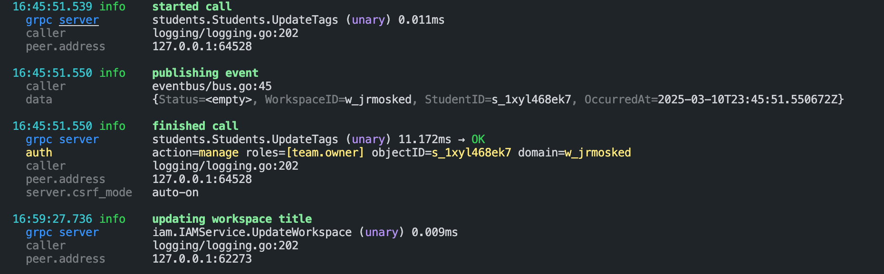

# Logista

_A command line utility for formatting JSON log streams in development_

Logista is a CLI tool for formatting JSON log streams. It's designed to be used
with server applications that output JSON logs, allowing for human-readable log
formatting without requiring the server to have separate production and
development logging formats.

Example:



## Installation

```
go install github.com/dpup/logista@latest
```

You can also use it as a tool in your project's go.mod file:

```
tool github.com/dpup/logista
```

## Usage

Formatting uses a super-set of Go's native templates, so any syntax that is a
valid Go template is also a valid formatting string in Logista. This means you
can use Go's powerful templating features, such as conditionals, loops, and
functions, to create highly customized log formats.

```sh
# Basic usage with default format
my-server | logista
my-server 2>&1 | logista

# Basic usage with gotool
my-server | go tool github.com/dpup/logista

# Simple syntax with custom log formats
my-server | logista --fmt="{timestamp} [{level}] {message}"
my-server | logista --fmt="{timestamp | date} [{level}] {message}"

# @symbol syntax for fields with special characters
my-server | logista --fmt="{@user.name} (ID: {@request-id})"

# Go template syntax (enables advanced features)
my-server | logista --fmt="{{.timestamp}} [{{.level}}] {{.message}}"

# Custom date format
my-server | logista --fmt="{timestamp | date} [{level}] {message}" --date_format="15:04:05"

# With message colored by log level (colors error red, warning yellow, etc)
my-server | logista --fmt="{timestamp | date} [{level}] {msg | colorByLevel .level}"

# With colored output and other formatting
my-server | logista --fmt='{{.timestamp | date | color "cyan"}} [{{.level}}] {{.message | colorByLevel .level | bold}}'

# Pretty-print complex objects like maps and arrays
my-server | logista --fmt="{{.timestamp | date}} [{{.level}}] {{.message}} {{.context | pretty}}"

# Disable colors
my-server | logista --fmt="{{.level | color \"red\"}} {{.message}}" --no-colors

# Skip log records by field value
my-server | logista --skip level=debug --skip level=trace        # Skip debug and trace logs
my-server | logista --skip logger=Uploader.download              # Skip logs from specific component
my-server | logista --skip level=error --skip logger=Worker      # Skip multiple patterns

# Handle non-JSON data in the input stream (e.g., stack traces or other text mixed with JSON logs)
my-server | logista --handle_non_json                            # Show non-JSON lines with a red prefix

# Help
logista --help
```

## Format Templates

Logista supports several syntax options for formatting logs:

1. **Simple Syntax**: Fields are enclosed in single curly braces. This is convenient for simple formats.

   ```
   {timestamp} [{level}] {message}
   ```

2. **@Symbol Syntax**: Fields can be accessed using the @symbol notation within Go template braces. This is especially useful for fields with special characters like periods, hyphens, or underscores.

   ```
   {@user.name} {@request-id} {@response_code}
   ```

3. **Full Go Template Syntax**: Fields are accessed using `.fieldname` within double curly braces. This enables powerful template features like conditionals, loops, and variable assignments.
   ```
   {{.timestamp}} [{{.level}}] {{.message}} {{if .context.user}}{{.context.user.id}}{{end}}
   ```

## Template Functions

Logista supports template functions that can transform field values. To use a function, add a pipe `|` after the field name, followed by the function name.

Either syntax supports functions:

```
{timestamp | date} [{level}] {message}
```

Or using full Go template syntax:

```
{{.timestamp | date}} [{{.level}}] {{.message}}
```

### Value Formatting Functions

| Command    | Description                                                                                                                                                                                                                                                                                                                                                                              | Example                             |
| ---------- | ---------------------------------------------------------------------------------------------------------------------------------------------------------------------------------------------------------------------------------------------------------------------------------------------------------------------------------------------------------------------------------------- | ----------------------------------- |
| **date**   | Parses dates in various formats into a standardized format. Works with: ISO 8601 timestamps (`2024-03-10T15:04:05Z`), Unix timestamps (`1741626507`) (seconds since epoch), Unix timestamps with fractional seconds (`1741626507.9066188`), Common log formats (`10/Mar/2024:15:04:05 +0000`), and many others. Use `--date_format` to set the output format in Go's time format syntax. | `{timestamp \| date}`               |
| **pad**    | Pads a string to a specified length.                                                                                                                                                                                                                                                                                                                                                     | `{level \| pad 10}`                 |
| **pretty** | Pretty-prints any value with proper formatting: maps as `{key=value, key=value}` with dim keys, arrays as `[value, value]` with dim commas, empty strings as `<empty>`, nil values as `<nil>`.                                                                                                                                                                                           | `{context \| pretty}`               |
| **table**  | Formats a map as a table with each field on a new line. Format is `key: value` with keys right-padded and dimmed. Empty values are omitted. Takes an optional padding parameter to control key column width.                                                                                                                                                                             | `{. \| table}` or `{. \| table 25}` |
| **wrap**   | Wraps text to a specified width with optional indentation for wrapped lines. Takes two parameters: width (required) and indent (optional). If text exceeds the specified width, it will be wrapped to multiple lines.                                                                                                                                                                    | `{description \| wrap 80 2}`        |
| **trunc**  | Truncates text to a specified length. If the text exceeds the length, it adds an ellipsis (...). Takes one parameter: the maximum length of the text.                                                                                                                                                                                                                                    | `{message \| trunc 20}`             |
| **mult**   | Multiplies a numeric value by the provided argument. If either the value or argument is not numeric, returns "NaN".                                                                                                                                                                                                                                                                      | `{count \| mult 2}`                 |
| **printf** | Formats a value using Go's `fmt.Sprintf` formatting. Takes a format string that follows Go's formatting syntax.                                                                                                                                                                                                                                                                          | `{value \| printf "%.2f"}`          |

### Color Functions

| Command          | Description                             | Example                           |
| ---------------- | --------------------------------------- | --------------------------------- |
| **color**        | Apply a specific color to a value       | `{level \| color "red"}`          |
| **colorByLevel** | Colors a value based on the level value | `{message \| colorByLevel level}` |
| **bold**         | Makes text bold                         | `{message \| bold}`               |
| **italic**       | Makes text italic                       | `{message \| italic}`             |
| **underline**    | Underlines text                         | `{message \| underline}`          |
| **dim**          | Makes text dim                          | `{timestamp \| dim}`              |

The following colors are available for use with color functions:

- Foreground colors: `black`, `red`, `green`, `yellow`, `blue`, `magenta`, `cyan`, `white`, `gray`
- Bright colors: `brightred`, `brightgreen`, `brightyellow`, `brightblue`, `brightmagenta`, `brightcyan`, `brightwhite`
- Background colors: `bg-black`, `bg-red`, `bg-green`, `bg-yellow`, `bg-blue`, `bg-magenta`, `bg-cyan`, `bg-white`, `bg-gray`
- Bright backgrounds: `bg-brightred`, `bg-brightgreen`, `bg-brightyellow`, `bg-brightblue`, `bg-brightmagenta`, `bg-brightcyan`, `bg-brightwhite`
- Formatting: `bold`, `italic`, `underline`, `dim`

Colors can be disabled with the `--no-colors` flag.

### Field Filtering Functions

| Command       | Description                                                                                                                                        | Example                                               |
| ------------- | -------------------------------------------------------------------------------------------------------------------------------------------------- | ----------------------------------------------------- |
| **hasPrefix** | Checks if a string has a specific prefix                                                                                                           | `{{if hasPrefix $key "grpc."}}`                       |
| **filter**    | Returns fields that don't match any of the provided patterns. Supports both exact field names and prefix matching with wildcards (e.g., "grpc.\*") | `{{range $key, $value := filter . "level" "grpc.*"}}` |

## Advanced Template Features

When using the full Go template syntax, you get access to all the template features like conditionals, loops, and variable assignments:

```go
{{- $timestamp := .timestamp | date | color "cyan" -}}
{{- $level := .level | colorByLevel .level -}}
{{- $message := .msg | bold -}}
{{- $grpcService := index . "grpc.service" -}}
{{- $grpcMethod := index . "grpc.method" -}}
{{- $grpcMethodType := index . "grpc.method_type" -}}

{{ $timestamp }} {{ $level }} {{ $message }}
{{ if $grpcService }}
  GRPC: {{ $grpcService }}.{{ $grpcMethod }} ({{ $grpcMethodType | color "yellow" }})
{{ end }}
```

You can filter fields using wildcards and iterate over the results:

```go
{{range $key, $value := filter . "level" "timestamp" "msg" "grpc.*"}}
{{$key}}: {{$value}}
{{end}}

```

## Structured Log Example

Here's a comprehensive example that clearly formats structured logs:

```go
{ts | date | color "cyan"} {level | colorByLevel .level} {msg | bold | trunc 15}} ({logger | dim})
{{if @grpc.service}}
  GRPC: {@grpc.service}.{@grpc.method} ({@grpc.method_type | color "yellow"})
{{end}}
{{if @description}}
  Description: {description | wrap 80 2}
{{end}}
{filter . "level" "ts" "msg" "logger" "caller" "description" "grpc.*" | table}
```

## Configuration

Logista supports configuration via command-line flags, environment variables, and configuration files.

### Command-line Flags

```
--config string              config file (default is $HOME/.logista.yaml)
--date_format string         Preferred date format for the date function (default "2006-01-02 15:04:05")
--enable_simple_syntax       Enable simple {field} syntax in templates (default true)
--format string              Format template (default "{{.timestamp | date}} {{.level}} {{.message}}")
--handle_non_json            Gracefully handle non-JSON data in the input stream
--no_colors                  Disable colored output
--skip stringSlice           Skip log records matching key=value pairs (can be specified multiple times)
```

### Environment Variables

Environment variables are prefixed with `LOGISTA_` and use underscores instead of dashes:

```
LOGISTA_CONFIG               Path to config file
LOGISTA_DATE_FORMAT          Preferred date format for the date function
LOGISTA_ENABLE_SIMPLE_SYNTAX Enable simple {field} syntax in templates
LOGISTA_FORMAT               Format template
LOGISTA_HANDLE_NON_JSON      Gracefully handle non-JSON data (set to "true")
LOGISTA_NO_COLORS            Disable colored output (set to "true")
LOGISTA_SKIP                 Skip log records matching key=value pairs (comma-separated list)
```

### Configuration File

By default, Logista looks for a configuration file named `.logista.yaml` in your home directory or the current directory. You can specify a custom configuration file with the `--config` flag.

Example configuration file (`~/.logista.yaml`):

```yaml
# Format template
format: "{timestamp | date} [{level}] {message}"

# Preferred date format for the date function
date_format: "15:04:05"

# Disable colors
no_colors: false

# Enable simple {field} syntax in templates
enable_simple_syntax: true

# Gracefully handle non-JSON data
handle_non_json: true

# Skip log records matching key=value pairs
skip:
  - level=error
  - logger=Uploader.download
```

### Configuration Precedence

Logista follows this order of precedence for configuration values (highest to lowest):

1. Command-line flags
2. Environment variables
3. Configuration file
4. Default values

## Building from Source

```
git clone https://github.com/dpup/logista.git
cd logista
make build
```

The binary will be created in the `dist` directory.

You can also install directly from source:

```
git clone https://github.com/dpup/logista.git
cd logista
make install
```

## Releasing

Logista uses [GoReleaser](https://goreleaser.com/) to automate releases. When a new tag is pushed to GitHub, a GitHub Actions workflow automatically builds binaries for multiple platforms and creates a new GitHub release.

To create a new release:

```
make release VERSION=1.0.0
```

This will:

1. Create a new git tag `v1.0.0`
2. Push the tag to GitHub
3. Which, triggers a GitHub Actions workflow that uses GoReleaser to build binaries
4. Create a new GitHub release with the built binaries

To test the release process locally without publishing:

```
make release-dry-run
```

## License

```
MIT License

Copyright (c) 2025 Daniel Pupius (pupius.com)

Permission is hereby granted, free of charge, to any person obtaining a copy
of this software and associated documentation files (the "Software"), to deal
in the Software without restriction, including without limitation the rights
to use, copy, modify, merge, publish, distribute, sublicense, and/or sell
copies of the Software, and to permit persons to whom the Software is
furnished to do so, subject to the following conditions:

The above copyright notice and this permission notice shall be included in all
copies or substantial portions of the Software.

THE SOFTWARE IS PROVIDED "AS IS", WITHOUT WARRANTY OF ANY KIND, EXPRESS OR
IMPLIED, INCLUDING BUT NOT LIMITED TO THE WARRANTIES OF MERCHANTABILITY,
FITNESS FOR A PARTICULAR PURPOSE AND NONINFRINGEMENT. IN NO EVENT SHALL THE
AUTHORS OR COPYRIGHT HOLDERS BE LIABLE FOR ANY CLAIM, DAMAGES OR OTHER
LIABILITY, WHETHER IN AN ACTION OF CONTRACT, TORT OR OTHERWISE, ARISING FROM,
OUT OF OR IN CONNECTION WITH THE SOFTWARE OR THE USE OR OTHER DEALINGS IN THE
SOFTWARE.
```
